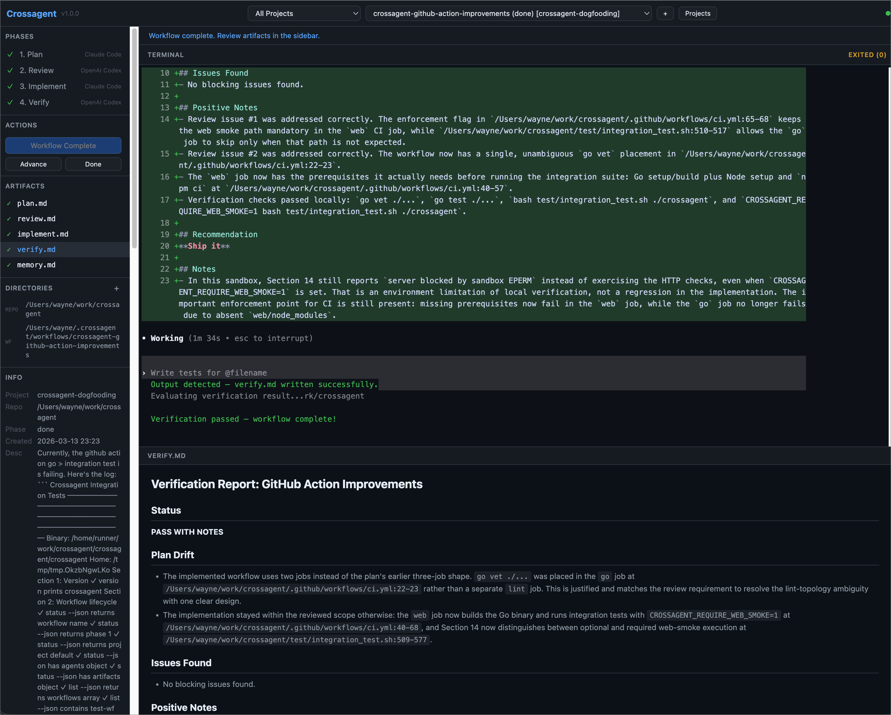

# Crossagent

**No single AI model should be both the maker and the checker.** Crossagent is a cross-model agent orchestrator that routes planning and implementation to one AI, then review and verification to another — the same maker-checker principle that makes human code review effective, applied to AI agents.

[](./LICENSE)

```
┌────────┐  plan.md  ┌────────┐  review.md  ┌────────┐  changes ┌────────┐
│ 1.PLAN ├──────────►│2.REVIEW├────────────►│3.IMPL  ├─────────►│4.VERIFY│
│ Claude │           │ Codex  │             │ Claude │          │ Codex  │
└────────┘           └────────┘             └────────┘          └────────┘
```



## Why Crossagent?

AI coding agents are powerful — but trusting a single model to plan, implement, *and* judge its own work is like letting a student grade their own exam. Crossagent exists because **no single AI model should be both the maker and the checker.**

We couldn't find any tool that addressed all of these problems at once, so we built one.

### Eliminate agent bias with cross-model review

This is the primary driver behind Crossagent. Most AI coding tools use one model for everything. Crossagent breaks that pattern by routing execution and review to **different AI providers** — Claude builds, Codex reviews (or vice versa). A second model with a different training lineage catches assumptions, blind spots, and failure modes that self-review misses. This maker-checker separation is the same principle that makes code review between humans effective, applied to AI agents.

### Transparent context engineering

Every input and output — plans, reviews, prompts, memory — is a **plain file** you can inspect, edit, and version-control. Nothing is hidden in opaque embeddings or databases. You can read exactly what your agents see and override anything before the next phase runs.

### Autonomous execution with sandboxed safety

No more clicking "approve" on every file edit. Crossagent runs agents in **full auto-execute mode** within a sandbox that only has access to the directories you explicitly specify. If the verification phase fails, it **automatically retries** the implement-verify cycle. Hands-off execution with guardrails — not hands-off with fingers crossed.

### Auto-improving memory across projects

Every workflow builds knowledge. Crossagent maintains **three tiers of persistent memory** — global, project, and workflow — and feeds it back into future runs automatically. Codebase patterns, conventions, lessons learned, and domain context compound across repositories. The tool gets smarter with every run instead of starting from zero each time.

### Predictable, fixed-cost billing

Crossagent runs on top of CLI tools that use **subscription-based plans** (Claude Code via Claude Pro/Max, Codex CLI via ChatGPT Pro), not per-token API billing. No surprise invoices, no cost anxiety mid-workflow. You know what you're paying before you start.

## Quick Start

### Prerequisites

- **Go 1.22+** and **Node.js 18+**
- [Claude Code CLI](https://docs.anthropic.com/en/docs/claude-code) and [Codex CLI](https://github.com/openai/codex) — both authenticated

### Install

```bash
git clone <this-repo> ~/tools/crossagent
cd ~/tools/crossagent
make build           # Compiles the Go binary
make install-ui      # Installs Web UI dependencies
```

<details>
<summary>Optional: install CLI to PATH, Go install, Windows</summary>

```bash
make install                        # /usr/local/bin (may prompt for sudo)
make install PREFIX=$HOME/.local    # User-local (~/.local/bin)
go install github.com/grikwong/crossagent/cmd/crossagent@latest
```

**Windows:** Use [WSL](https://learn.microsoft.com/en-us/windows/wsl/) and follow the steps above.
</details>

### Launch

```bash
make start    # Build + preflight checks + Web UI at http://localhost:3456
make check    # Verify prerequisites only
```

### Your first workflow

1. Click **+** — enter a name, repo path, and feature description.
2. **Run Plan** — Claude writes `plan.md`. Review it in the artifact sidebar.
3. **Run Review** — Codex reviews the plan and writes `review.md`.
4. **Run Implement** — Claude implements per the reviewed plan.
5. **Run Verify** — Codex examines the diff and writes `verify.md`.

## How Each Phase Works

| Phase | Agent | Produces | Key outputs |
|-------|-------|----------|-------------|
| **1. Plan** | Claude Code | `plan.md` | Overview, affected files, implementation phases, test gates, risks |
| **2. Review** | Codex CLI | `review.md` | Edge cases, correctness, security, verdict (APPROVE / APPROVE WITH CHANGES / REQUEST REWORK) |
| **3. Implement** | Claude Code | Code changes | Reads plan + review. Use `--phase N` for sub-phases |
| **4. Verify** | Codex CLI | `verify.md` | Status (PASS / FAIL), plan drift, issues, ship recommendation |

## Web UI Controls

| Control | Action |
|---------|--------|
| **Run [Phase]** | Starts the current phase in the embedded terminal |
| **Advance** | Manually advance to the next phase |
| **Done** | Mark the workflow complete |
| **Artifact sidebar** | Click any artifact to view rendered markdown |
| **Workflow selector** | Switch between workflows |

**Environment variables:** `CROSSAGENT_PORT` (default `3456`), `CROSSAGENT_BIN` (default `../crossagent`), `CROSSAGENT_HOME` (default `~/.crossagent`).

## CLI Reference

The CLI is the engine under the Web UI. It also works standalone.

### Workflows

```bash
crossagent new <name> [--repo <path>] [--add-dir <path>]...
crossagent status [--json]
crossagent list [--json]
crossagent use <name>
crossagent reset <name>
```

### Phases

```bash
crossagent plan [--force]
crossagent review [--force]
crossagent implement [--phase <n>] [--force]
crossagent verify [--force]
crossagent next                     # Run whatever comes next
```

### Projects

Workflows are grouped under projects (defaults to `default`). Projects provide scoped memory shared across related workflows.

```bash
crossagent projects list [--json]
crossagent projects new <name>
crossagent projects delete <name>
crossagent projects show <name> [--json]
crossagent projects rename <old> <new>
crossagent projects suggest [--description <text>] [--json]
crossagent move <workflow> --project <project>
```

### Memory

Three tiers: workflow (`memory.md`), project (`~/.crossagent/projects/<name>/memory/`), and global (`~/.crossagent/memory/`).

```bash
crossagent memory show [--global|--project [name]] [--json]
crossagent memory list [--global|--project [name]] [--json]
crossagent memory edit [--global|--project [name]]
```

### Agents

Ships with builtin `claude` and `codex` agents. Register custom agents and reassign phases:

```bash
crossagent agents list [--json]
crossagent agents add <name> --adapter <claude|codex> [--command <cmd>] [--display-name <name>]
crossagent agents remove <name>
crossagent agents show [--workflow <name>] [--json]
crossagent agents assign <phase> <agent> [--workflow <name>]
crossagent agents reset <phase> [--workflow <name>]
```

### Navigation and automation

```bash
crossagent advance                  # Manually advance phase
crossagent done                     # Mark workflow complete
crossagent log                      # Display all artifacts
crossagent open                     # Open workflow directory
crossagent phase-cmd <phase> --json # Launch params without executing (used by Web UI)
```

## Multi-Repo Workflows

```bash
crossagent new cross-repo-feature \
  --repo ~/projects/backend \
  --add-dir ~/projects/frontend \
  --add-dir ~/projects/shared-types
```

All agents get access to all specified directories.

## Tips

- **Don't skip review.** It catches architectural issues before you spend time implementing.
- **Use sub-phases.** Break implementation into small testable chunks with `--phase N`.
- **Read the artifacts.** They're your documentation — plan, review, verification report.
- **Force re-runs.** If a phase produced poor results, use `--force` to redo it.

## Project Status

Crossagent is free, open source, and local-first. It is usable today but should be treated as operator tooling for technically capable users who can install the required CLIs and review generated output.

## Architecture

Layered design — see [docs/architecture.md](docs/architecture.md) for the full decision record.

| Layer | Role | Location |
|-------|------|----------|
| Core | Go binary — state, agents, prompts, judging | `cmd/`, `internal/` |
| Integration | `--json` output for machine consumption | CLI flags |
| Web UI | Browser app — terminals, artifacts, workflows | `web/` |

Zero external Go dependencies — only the standard library.

<details>
<summary>Source layout</summary>

```text
crossagent/
├── cmd/crossagent/main.go       # CLI entry point
├── internal/
│   ├── state/                   # Config, workflow, project, memory
│   ├── agent/                   # Agent registry, phase assignments, launcher
│   ├── cli/                     # JSON types, ordered serialization
│   ├── prompt/                  # Template-based prompt generation & memory context
│   │   └── templates/           # Embedded Go templates
│   └── judge/                   # Verdict parsing for review & verify
├── web/                         # Node.js + vanilla JS frontend
├── test/                        # Integration tests
├── docs/                        # Architecture decision records
└── Makefile
```

State is stored in `~/.crossagent/` — workflows, projects, agents, and memory tiers are all plain files.
</details>

## Development

```bash
make build    # Compile
make test     # Unit + integration tests
make clean    # Remove build artifacts
make check    # Preflight checks
make start    # Build + check + launch Web UI
```

## Uninstall

```bash
make uninstall          # Removes CLI binary
rm -rf web/node_modules # Removes Web UI dependencies
rm -rf ~/.crossagent    # Removes all workflow data
```

## License

[AGPL-3.0-or-later](./LICENSE) — free for commercial use. If you modify Crossagent and serve it to users (including over a network), you must share the source under the same license.

## Contributing

See [`CONTRIBUTING.md`](./CONTRIBUTING.md) and [`CODE_OF_CONDUCT.md`](./CODE_OF_CONDUCT.md). Open an issue before large changes.

## Contributors

See [`CONTRIBUTORS.md`](./CONTRIBUTORS.md).

## Security

Report vulnerabilities via [`SECURITY.md`](./SECURITY.md). Do not open public issues for undisclosed vulnerabilities.
