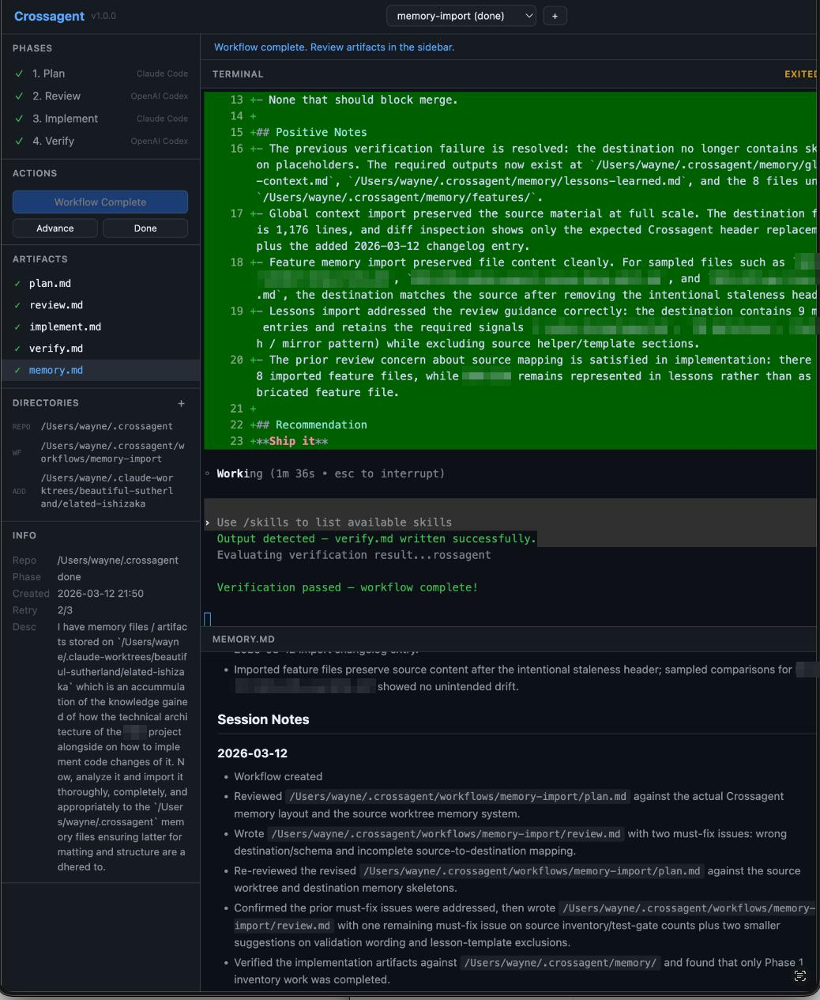

# Crossagent

Cross-model AI agent orchestrator with a browser-based UI. Uses **Claude Code** as planner/implementer and **Codex CLI** as reviewer/verifier across a structured 4-phase workflow.

[](./LICENSE)

```
┌────────┐  plan.md  ┌────────┐  review.md  ┌────────┐  changes  ┌────────┐
│ 1.PLAN ├──────────►│2.REVIEW├────────────►│3.IMPL  ├─────────►│4.VERIFY│
│ Claude │           │ Codex  │             │ Claude │          │ Codex  │
└────────┘           └────────┘             └────────┘          └────────┘
```



## Why Crossagent?

AI coding agents are powerful — but trusting a single model to plan, implement, *and* judge its own work is like letting a student grade their own exam. Crossagent exists because **no single AI model should be both the maker and the checker.**

We couldn't find any tool that addressed all four of these problems at once, so we built one.

### Eliminate agent bias with cross-model review

Most AI coding tools use one model for everything. Crossagent breaks that pattern by routing execution and review to **different AI providers** — Claude builds, Codex reviews (or vice versa). A second model with a different training lineage catches assumptions, blind spots, and failure modes that self-review misses. This maker-checker separation is the same principle that makes code review between humans effective, applied to AI agents.

### Predictable, fixed-cost billing

Crossagent runs on top of CLI tools that use **subscription-based plans** (Claude Code via Claude Pro/Max, Codex CLI via ChatGPT Pro), not per-token API billing. No surprise invoices, no cost anxiety mid-workflow. You know what you're paying before you start.

### Auto-improving three-tier memory

Every workflow builds knowledge. Crossagent maintains **persistent memory at three scopes** — global (cross-project), project (per-project patterns and features), and workflow (per-task decisions) — and feeds it back into future workflows automatically. In multi-project, multi-repo setups, the tool gets smarter with every run instead of starting from zero each time.

### Context engineering through file-based RAG

AI agents live and die by what fits in their context window. Crossagent treats context as a first-class engineering problem — it uses **retrieval-augmented generation** to feed each phase agent exactly the context it needs: relevant memory tiers, prior phase outputs, and project knowledge, all assembled from plain files on disk. Every input and output — plans, reviews, prompts, memory — is a **human-readable file** you can inspect, edit, and version-control. Nothing is hidden in opaque embeddings or databases. This means you can verify what the agent saw, manually correct or enrich context before a phase runs, and build up reusable project knowledge that compounds over time. Crossagent doesn't just run agents — it helps you do context engineering properly, efficiently, and transparently.

### Autonomous execution with sandboxed safety

No more clicking "approve" on every file edit. Crossagent runs agents in **full auto-execute mode** within a sandbox that only has access to the directories you explicitly specify. If the verification phase fails, it **automatically retries** the implement-verify cycle. Hands-off execution with guardrails — not hands-off with fingers crossed.

## Prerequisites

- **Go 1.22+** — for building the core binary
- **Node.js 18+** — for the Web UI
- [Claude Code CLI](https://docs.anthropic.com/en/docs/claude-code) — authenticated and working
- [Codex CLI](https://github.com/openai/codex) — authenticated and working

## Project Status

Crossagent is intended to be released as free and open source software for local-first use by developers and teams. The project is usable now, but public releases should still be treated as operator tooling for technically capable users who can install the required CLIs and review generated output.

## Install

### macOS / Linux

```bash
git clone <this-repo> ~/tools/crossagent
cd ~/tools/crossagent
make build           # Compiles the Go binary
make install-ui      # Installs Web UI dependencies
```

Optionally install the CLI to your PATH (not required for Web UI):

```bash
make install                        # Copies binary to /usr/local/bin (may prompt for sudo)
make install PREFIX=$HOME/.local    # Alternative: user-local (add ~/.local/bin to PATH)
```

Or install directly via Go:

```bash
go install github.com/pvotal-tech/crossagent/cmd/crossagent@latest
```

### Windows

Use [WSL](https://learn.microsoft.com/en-us/windows/wsl/) (Windows Subsystem for Linux) and follow the macOS/Linux instructions above. Native Windows is not yet supported.

## Quick Start

```bash
cd ~/tools/crossagent
make start
```

This runs preflight checks (Go binary, Node.js, CLI tools, dependencies) and launches the Web UI at [http://localhost:3456](http://localhost:3456).

To verify prerequisites without starting the server:

```bash
make check
```

### Create a workflow

1. Click **+** in the top bar.
2. Enter a name (e.g. `add-search`), the repository path, and a feature description.
3. Click **Create**.

### Run phases

1. Click **Run Plan** — Claude opens in the embedded terminal and writes `plan.md`.
2. When the session ends, the phase tracker advances. Click the `plan.md` artifact to review it.
3. Click **Run Review** — Codex reviews the plan and writes `review.md`.
4. Click **Run Implement** — Claude implements per the reviewed plan.
5. Click **Run Verify** — Codex verifies and writes `verify.md`.

### Controls

| Button | Action |
|--------|--------|
| **Run [Phase]** | Starts the current phase in the embedded terminal |
| **Advance** | Manually advance to the next phase (if auto-detection missed it) |
| **Done** | Mark the workflow complete |
| **Artifact sidebar** | Click any artifact to view its rendered markdown |
| **Workflow selector** | Switch between workflows from the dropdown |

### Web UI configuration

| Variable | Default | Description |
|----------|---------|-------------|
| `CROSSAGENT_PORT` | `3456` | Server port |
| `CROSSAGENT_BIN` | `../crossagent` | Path to the compiled Go binary |
| `CROSSAGENT_HOME` | `~/.crossagent` | Workflow state directory |

## CLI Reference

The CLI is the engine under the Web UI. It also works standalone.

### Workflows

```bash
crossagent new <name> [--repo <path>] [--add-dir <path>]...
crossagent status [--json]
crossagent list [--json]
crossagent use <name>
crossagent reset <name>
```

Notes:
- `--repo` must point to an existing directory (defaults to current directory)
- each `--add-dir` must point to an existing directory
- extra directory paths cannot contain commas

### Phases

```bash
crossagent plan [--force]
crossagent review [--force]
crossagent implement [--phase <n>] [--force]
crossagent verify [--force]
crossagent next                     # Run whatever comes next
```

### Projects

```bash
crossagent projects list [--json]
crossagent projects new <name>
crossagent projects delete <name>
crossagent projects show <name> [--json]
crossagent projects rename <old> <new>
crossagent projects suggest [--description <text>] [--json]
crossagent move <workflow> --project <project>
```

Workflows are grouped under projects. Each workflow belongs to exactly one project (defaults to `default`). Projects provide scoped memory shared across related workflows. When creating a workflow under `default`, Crossagent can suggest a better-matching project based on the description.

### Memory

```bash
crossagent memory show [--global|--project [name]] [--json]
crossagent memory list [--global|--project [name]] [--json]
crossagent memory edit [--global|--project [name]]
```

- Without flags, operates on the current workflow's `memory.md`
- With `--global`, operates on `~/.crossagent/memory/` (global context and lessons learned)
- With `--project`, operates on project memory (defaults to current workflow's project)
- `edit --global` opens `global-context.md` in your `$EDITOR`

### Navigation and recovery

```bash
crossagent advance                  # Manually advance phase
crossagent done                     # Mark workflow complete
crossagent log                      # Display all artifacts
crossagent open                     # Open workflow directory in file browser
```

### Agents

Crossagent ships with builtin `claude` and `codex` agents. You can register custom agents and reassign phases:

```bash
crossagent agents list [--json]
crossagent agents add <name> --adapter <claude|codex> [--command <cmd>] [--display-name <name>]
crossagent agents remove <name>
crossagent agents show [--workflow <name>] [--json]
crossagent agents assign <phase> <agent> [--workflow <name>]
crossagent agents reset <phase> [--workflow <name>]
```

### Integration / automation

```bash
crossagent status --json
crossagent list --json
crossagent phase-cmd <phase> --json [--force] [--phase <n>]
```

`phase-cmd` returns the exact command, args, cwd, prompt file, and output file for a phase without launching it. This is how the Web UI gets its launch parameters.

## How Each Phase Works

### Phase 1: Plan (Claude Code)
Claude explores your codebase and writes `plan.md` — overview, affected files, implementation phases, test gates, risks.

### Phase 2: Review (Codex CLI)
Codex reads the plan against your actual code and writes `review.md` — missing edge cases, correctness, security concerns, verdict (APPROVE / APPROVE WITH CHANGES / REQUEST REWORK).

### Phase 3: Implement (Claude Code)
Claude reads plan + review and implements. Use `--phase N` for sub-phases.

### Phase 4: Verify (Codex CLI)
Codex examines the git diff against the plan and writes `verify.md` — status (PASS / FAIL), plan drift, issues, ship recommendation.

## Multi-Repo Workflows

```bash
crossagent new cross-repo-feature \
  --repo ~/projects/backend \
  --add-dir ~/projects/frontend \
  --add-dir ~/projects/shared-types
```

All assigned agents get access to all specified directories.

## Tips

- **Don't skip review.** It catches architectural issues before you spend time implementing.
- **Use sub-phases.** Break implementation into small testable chunks with `--phase N`.
- **Read the artifacts.** They're your documentation — plan, review, verification report.
- **Force re-runs.** If a phase produced poor results, use `--force` to redo it.

## Source Layout

```text
crossagent/
├── go.mod                       # Go module (github.com/pvotal-tech/crossagent)
├── cmd/crossagent/main.go       # Go CLI entry point (fully wired)
├── internal/
│   ├── state/                   # Data layer — config, workflow, project, memory
│   ├── agent/                   # Agent registry, phase assignments, CLI launcher
│   ├── cli/                     # JSON types, ordered serialization, hybrid formatting
│   ├── prompt/                  # Template-based prompt generation & memory context
│   └── judge/                   # Verdict parsing for review & verify outputs
├── test/                        # Integration test suite
│   └── integration_test.sh
├── web/                         # Web UI (Node.js + vanilla JS)
│   ├── server.js
│   ├── package.json
│   └── public/
├── docs/                        # Architecture decision records
├── Makefile                     # Build, test, install targets
└── CLAUDE.md
```

## Workflow Storage

```text
~/.crossagent/
├── current
├── agents/<name>
├── projects/                    # Project hierarchy
│   ├── default/
│   │   └── memory/
│   │       ├── project-context.md
│   │       ├── lessons-learned.md
│   │       └── features/        # Feature-level memory
│   └── <name>/
│       └── memory/
│           ├── project-context.md
│           └── lessons-learned.md
├── memory/
│   ├── global-context.md       # Cross-project patterns & conventions
│   └── lessons-learned.md      # Retrospective insights
└── workflows/<name>/
    ├── config                   # Includes project=<name>
    ├── description
    ├── phase
    ├── memory.md                # Workflow-scoped memory
    ├── plan.md
    ├── review.md
    ├── verify.md
    └── prompts/
        ├── plan.md
        ├── review.md
        ├── implement.md
        └── verify.md
```

## Architecture

Layered design — see [docs/architecture.md](docs/architecture.md) for the full decision record.

| Layer | What | Where |
|-------|------|-------|
| Core | Go binary — state management, agent orchestration, prompts, judging | `cmd/`, `internal/` |
| Integration | `--json` output for machine consumption | CLI flags |
| Web UI | Browser app — terminals, artifacts, workflow management | `web/` |

### Go package structure

```
cmd/crossagent/main.go           # CLI entry point (fully wired)

internal/state/
├── config.go                    # Workflow config read/write with file locking
├── workflow.go                  # Workflow & directory state management
├── project.go                   # Project CRUD & suggestion engine
├── memory.go                    # Three-tier memory initialization
└── time.go                      # Time utilities

internal/agent/
├── agent.go                     # Agent registry, builtin/custom agents, phase assignments
└── launcher.go                  # Launch parameter building, sandbox settings, agent execution

internal/cli/
└── output.go                    # JSON types, ordered serialization, hybrid formatting

internal/prompt/
├── generate.go                  # Prompt generation for all four phases
├── memory.go                    # Three-tier memory context & update instructions
├── templates.go                 # Embedded template loader
└── templates/                   # Go text/template files (general, plan, review, implement, verify)

internal/judge/
└── verdict.go                   # Verdict parsing (pass/fail/rework) from review & verify outputs
```

Zero external dependencies — only the Go standard library.

## Development

```bash
make build    # Compile the Go binary
make test     # Run unit tests + integration tests
make clean    # Remove build artifacts
make check    # Preflight checks (Go, Node, CLIs, dependencies)
make start    # Build + check + launch web UI
```

## Uninstall

```bash
make uninstall          # Removes CLI binary from /usr/local/bin
rm -rf web/node_modules # Removes Web UI dependencies
rm -rf ~/.crossagent    # Removes all workflow data
```

## License

This project is licensed under the GNU Affero General Public License, version 3 or later ([`AGPL-3.0-or-later`](./LICENSE)).

Why this license:

- It allows commercial and professional use.
- If someone modifies Crossagent and makes that modified version available to users, including over a network, they must provide the corresponding source code under the same license.
- It is the closest standard FOSS license to "improvements must remain open."

Important limitation:

AGPL does **not** force third parties to submit their changes back to this repository as pull requests. It requires source availability to users of the modified software, not mandatory upstream contribution.

## Contributing

Contributions are welcome. Start with [`CONTRIBUTING.md`](./CONTRIBUTING.md), review the [`CODE_OF_CONDUCT.md`](./CODE_OF_CONDUCT.md), and open an issue before large changes if you want alignment on scope.

By contributing, you agree that your contribution will be licensed under the same AGPL-3.0-or-later license as the rest of the project.

## Contributors

See [`CONTRIBUTORS.md`](./CONTRIBUTORS.md) for the current maintainer list and attribution policy for future contributors.

## Security

If you find a security issue, follow the reporting process in [`SECURITY.md`](./SECURITY.md). Do not open a public issue for undisclosed vulnerabilities.
